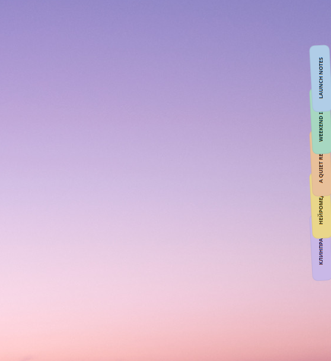
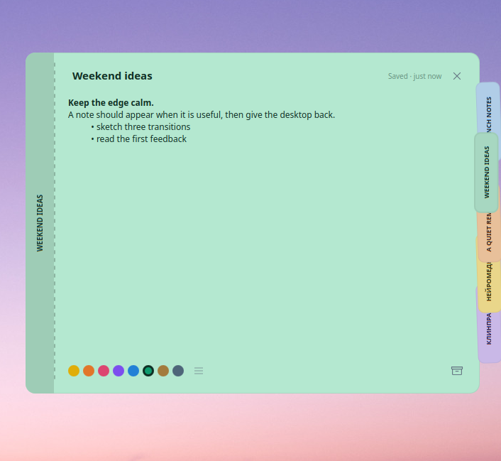

# Noty Linux

**Local-first edge notes for Linux desktops. The first shipping integration targets KDE Plasma 6.**

Noty Linux is a free, local-first project for desktop notes that stay nearby
without taking over the screen. The Plasma widget sleeps as a small edge
indicator, fans into coloured tabs when you reach it, and opens a note without
scattering windows over the desktop.

<p align="center">
  <a href="docs/website/guide.en.md">English</a> ·
  <a href="docs/website/guide.ru.md">Русский</a> ·
  <a href="docs/website/guide.es.md">Español</a> ·
  <a href="docs/website/guide.de.md">Deutsch</a> ·
  <a href="docs/website/guide.fr.md">Français</a>
</p>

<p align="center">
  
</p>

<p align="center">
  
  
</p>

<p align="center"><sub>Real, uncropped KDE Plasma captures · <a href="website/assets/screenshots/edge-tabs-full.png">resting deck</a> · <a href="website/assets/screenshots/open-note-full.png">open note</a></sub></p>

## What it does

- A compact edge indicator, fanned tabs and an open note card.
- Pastel notes with an editable, reorderable palette; the first colour is a
  protected fallback.
- Markdown display, inline checklist tasks, optional ruled paper and archive
  recovery with configurable retention.
- Three appearance modes: Noty, Adaptive and Plasma. The default Adaptive mode
  keeps coloured paper readable while following Plasma typography.
- A single bundled icon language: Phosphor Regular. Plasma icon-theme lookup is
  an explicit optional setting.
- Interface translations: English, Russian, Spanish, Indonesian, German,
  French, Portuguese, Chinese, Japanese and Hindi.

## Install the Plasma widget

```bash
git clone https://github.com/rodmanvictor/noty-linux.git
cd noty-linux
kpackagetool6 --type Plasma/Applet --upgrade plasmoid/package
```

Then enter Plasma desktop edit mode, choose **Add Widgets**, search for
**Noty**, and place it against a screen edge.

## Verify changes

```bash
npm run docs:check
npm run test:site
npm run test:plasmoid
```

`test:plasmoid` needs the Qt 6 QML test runner and is intended for a KDE/Qt
development environment. It also renders visual snapshots for the card,
archive, appearance settings and icon system.

## Optional native companion

`linux/` contains an experimental Qt/KDE companion application. The supported
community distribution is the Plasma widget under `plasmoid/package/`.

```bash
cmake -S . -B build -DCMAKE_BUILD_TYPE=Release
cmake --build build --parallel
cmake --install build
```

See [the documentation](docs/index.md) for architecture, visual checks, public
guides and licensing. Contributions are welcome under the MIT license.
